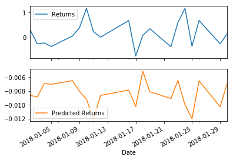

```python
import numpy as np
import pandas as pd
from pathlib import Path
%matplotlib inline
from sklearn.linear_model import LinearRegression
from sklearn.metrics import mean_squared_error, r2_score

import warnings
warnings.filterwarnings('ignore')
```

# Regression Analysis: Seasonal Effects with Sklearn Linear Regression
In this notebook, you will build a SKLearn linear regression model to predict Yen futures ("settle") returns with *lagged* Yen futures returns. 


```python
# Futures contract on the Yen-dollar exchange rate:
# This is the continuous chain of the futures contracts that are 1 month to expiration
yen_futures = pd.read_csv(
    Path("yen.csv"), index_col="Date", infer_datetime_format=True, parse_dates=True
)
yen_futures.head()
```


<div>
<style scoped>
    .dataframe tbody tr th:only-of-type {
        vertical-align: middle;
    }

    .dataframe tbody tr th {
        vertical-align: top;
    }

    .dataframe thead th {
        text-align: right;
    }
</style>
<table border="1" class="dataframe">
  <thead>
    <tr style="text-align: right;">
      <th></th>
      <th>Open</th>
      <th>High</th>
      <th>Low</th>
      <th>Last</th>
      <th>Change</th>
      <th>Settle</th>
      <th>Volume</th>
      <th>Previous Day Open Interest</th>
    </tr>
    <tr>
      <th>Date</th>
      <th></th>
      <th></th>
      <th></th>
      <th></th>
      <th></th>
      <th></th>
      <th></th>
      <th></th>
    </tr>
  </thead>
  <tbody>
    <tr>
      <th>1976-08-02</th>
      <td>3398.0</td>
      <td>3401.0</td>
      <td>3398.0</td>
      <td>3401.0</td>
      <td>NaN</td>
      <td>3401.0</td>
      <td>2.0</td>
      <td>1.0</td>
    </tr>
    <tr>
      <th>1976-08-03</th>
      <td>3401.0</td>
      <td>3401.0</td>
      <td>3401.0</td>
      <td>3401.0</td>
      <td>NaN</td>
      <td>3401.0</td>
      <td>0.0</td>
      <td>1.0</td>
    </tr>
    <tr>
      <th>1976-08-04</th>
      <td>3401.0</td>
      <td>3401.0</td>
      <td>3401.0</td>
      <td>3401.0</td>
      <td>NaN</td>
      <td>3401.0</td>
      <td>0.0</td>
      <td>1.0</td>
    </tr>
    <tr>
      <th>1976-08-05</th>
      <td>3401.0</td>
      <td>3401.0</td>
      <td>3401.0</td>
      <td>3401.0</td>
      <td>NaN</td>
      <td>3401.0</td>
      <td>0.0</td>
      <td>1.0</td>
    </tr>
    <tr>
      <th>1976-08-06</th>
      <td>3401.0</td>
      <td>3401.0</td>
      <td>3401.0</td>
      <td>3401.0</td>
      <td>NaN</td>
      <td>3401.0</td>
      <td>0.0</td>
      <td>1.0</td>
    </tr>
  </tbody>
</table>
</div>


```python
# Trim the dataset to begin on January 1st, 1990
yen_futures = yen_futures.loc["1990-01-01":, :]
yen_futures.head()
```


<div>
<style scoped>
    .dataframe tbody tr th:only-of-type {
        vertical-align: middle;
    }

    .dataframe tbody tr th {
        vertical-align: top;
    }

    .dataframe thead th {
        text-align: right;
    }
</style>
<table border="1" class="dataframe">
  <thead>
    <tr style="text-align: right;">
      <th></th>
      <th>Open</th>
      <th>High</th>
      <th>Low</th>
      <th>Last</th>
      <th>Change</th>
      <th>Settle</th>
      <th>Volume</th>
      <th>Previous Day Open Interest</th>
    </tr>
    <tr>
      <th>Date</th>
      <th></th>
      <th></th>
      <th></th>
      <th></th>
      <th></th>
      <th></th>
      <th></th>
      <th></th>
    </tr>
  </thead>
  <tbody>
    <tr>
      <th>1990-01-02</th>
      <td>6954.0</td>
      <td>6954.0</td>
      <td>6835.0</td>
      <td>6847.0</td>
      <td>NaN</td>
      <td>6847.0</td>
      <td>48336.0</td>
      <td>51473.0</td>
    </tr>
    <tr>
      <th>1990-01-03</th>
      <td>6877.0</td>
      <td>6910.0</td>
      <td>6865.0</td>
      <td>6887.0</td>
      <td>NaN</td>
      <td>6887.0</td>
      <td>38206.0</td>
      <td>53860.0</td>
    </tr>
    <tr>
      <th>1990-01-04</th>
      <td>6937.0</td>
      <td>7030.0</td>
      <td>6924.0</td>
      <td>7008.0</td>
      <td>NaN</td>
      <td>7008.0</td>
      <td>49649.0</td>
      <td>55699.0</td>
    </tr>
    <tr>
      <th>1990-01-05</th>
      <td>6952.0</td>
      <td>6985.0</td>
      <td>6942.0</td>
      <td>6950.0</td>
      <td>NaN</td>
      <td>6950.0</td>
      <td>29944.0</td>
      <td>53111.0</td>
    </tr>
    <tr>
      <th>1990-01-08</th>
      <td>6936.0</td>
      <td>6972.0</td>
      <td>6936.0</td>
      <td>6959.0</td>
      <td>NaN</td>
      <td>6959.0</td>
      <td>19763.0</td>
      <td>52072.0</td>
    </tr>
  </tbody>
</table>
</div>


# Data Preparation

### Returns


```python
# Create a series using "Settle" price percentage returns, drop any nan"s, and check the results:
# (Make sure to multiply the pct_change() results by 100)
# In this case, you may have to replace inf, -inf values with np.nan"s

returns = (yen_futures[["Settle"]].pct_change() * 100)
returns = returns.replace(-np.inf, np.nan).dropna()
yen_futures['Returns']= (yen_futures[["Settle"]].pct_change() * 100)
yen_futures.dropna(inplace=True)
yen_futures.head()
```


<div>
<style scoped>
    .dataframe tbody tr th:only-of-type {
        vertical-align: middle;
    }

    .dataframe tbody tr th {
        vertical-align: top;
    }

    .dataframe thead th {
        text-align: right;
    }
</style>
<table border="1" class="dataframe">
  <thead>
    <tr style="text-align: right;">
      <th></th>
      <th>Open</th>
      <th>High</th>
      <th>Low</th>
      <th>Last</th>
      <th>Change</th>
      <th>Settle</th>
      <th>Volume</th>
      <th>Previous Day Open Interest</th>
      <th>Returns</th>
    </tr>
    <tr>
      <th>Date</th>
      <th></th>
      <th></th>
      <th></th>
      <th></th>
      <th></th>
      <th></th>
      <th></th>
      <th></th>
      <th></th>
    </tr>
  </thead>
  <tbody>
    <tr>
      <th>2014-02-18</th>
      <td>9831.0</td>
      <td>9865.0</td>
      <td>9734.0</td>
      <td>9775.0</td>
      <td>42.0</td>
      <td>9775.0</td>
      <td>203495.0</td>
      <td>196924.0</td>
      <td>-0.427829</td>
    </tr>
    <tr>
      <th>2014-02-19</th>
      <td>9768.0</td>
      <td>9825.0</td>
      <td>9760.0</td>
      <td>9773.0</td>
      <td>2.0</td>
      <td>9773.0</td>
      <td>129508.0</td>
      <td>197197.0</td>
      <td>-0.020460</td>
    </tr>
    <tr>
      <th>2014-02-20</th>
      <td>9774.0</td>
      <td>9837.0</td>
      <td>9765.0</td>
      <td>9775.0</td>
      <td>2.0</td>
      <td>9775.0</td>
      <td>160202.0</td>
      <td>198280.0</td>
      <td>0.020465</td>
    </tr>
    <tr>
      <th>2014-02-21</th>
      <td>9772.0</td>
      <td>9776.0</td>
      <td>9725.0</td>
      <td>9758.0</td>
      <td>20.0</td>
      <td>9755.0</td>
      <td>103091.0</td>
      <td>202990.0</td>
      <td>-0.204604</td>
    </tr>
    <tr>
      <th>2014-02-24</th>
      <td>9752.0</td>
      <td>9789.0</td>
      <td>9740.0</td>
      <td>9757.0</td>
      <td>2.0</td>
      <td>9757.0</td>
      <td>90654.0</td>
      <td>203114.0</td>
      <td>0.020502</td>
    </tr>
  </tbody>
</table>
</div>


### Lagged Returns 


```python
# Create a lagged return using the shift function

yen_futures['Lagged_Return'] = yen_futures.Returns.shift()
yen_futures.dropna(inplace=True)
yen_futures.head()
```


<div>
<style scoped>
    .dataframe tbody tr th:only-of-type {
        vertical-align: middle;
    }

    .dataframe tbody tr th {
        vertical-align: top;
    }

    .dataframe thead th {
        text-align: right;
    }
</style>
<table border="1" class="dataframe">
  <thead>
    <tr style="text-align: right;">
      <th></th>
      <th>Open</th>
      <th>High</th>
      <th>Low</th>
      <th>Last</th>
      <th>Change</th>
      <th>Settle</th>
      <th>Volume</th>
      <th>Previous Day Open Interest</th>
      <th>Returns</th>
      <th>Lagged_Return</th>
    </tr>
    <tr>
      <th>Date</th>
      <th></th>
      <th></th>
      <th></th>
      <th></th>
      <th></th>
      <th></th>
      <th></th>
      <th></th>
      <th></th>
      <th></th>
    </tr>
  </thead>
  <tbody>
    <tr>
      <th>2014-02-19</th>
      <td>9768.0</td>
      <td>9825.0</td>
      <td>9760.0</td>
      <td>9773.0</td>
      <td>2.0</td>
      <td>9773.0</td>
      <td>129508.0</td>
      <td>197197.0</td>
      <td>-0.020460</td>
      <td>-0.427829</td>
    </tr>
    <tr>
      <th>2014-02-20</th>
      <td>9774.0</td>
      <td>9837.0</td>
      <td>9765.0</td>
      <td>9775.0</td>
      <td>2.0</td>
      <td>9775.0</td>
      <td>160202.0</td>
      <td>198280.0</td>
      <td>0.020465</td>
      <td>-0.020460</td>
    </tr>
    <tr>
      <th>2014-02-21</th>
      <td>9772.0</td>
      <td>9776.0</td>
      <td>9725.0</td>
      <td>9758.0</td>
      <td>20.0</td>
      <td>9755.0</td>
      <td>103091.0</td>
      <td>202990.0</td>
      <td>-0.204604</td>
      <td>0.020465</td>
    </tr>
    <tr>
      <th>2014-02-24</th>
      <td>9752.0</td>
      <td>9789.0</td>
      <td>9740.0</td>
      <td>9757.0</td>
      <td>2.0</td>
      <td>9757.0</td>
      <td>90654.0</td>
      <td>203114.0</td>
      <td>0.020502</td>
      <td>-0.204604</td>
    </tr>
    <tr>
      <th>2014-02-25</th>
      <td>9760.0</td>
      <td>9808.0</td>
      <td>9744.0</td>
      <td>9789.0</td>
      <td>32.0</td>
      <td>9789.0</td>
      <td>105498.0</td>
      <td>201486.0</td>
      <td>0.327970</td>
      <td>0.020502</td>
    </tr>
  </tbody>
</table>
</div>


### Train Test Split


```python
# Create a train/test split for the data using 2018-2019 for testing and the rest for training

train = yen_futures[:'2017']
test = yen_futures['2018':]
```


```python
# Create four dataframes:
# X_train (training set using just the independent variables), X_test (test set of of just the independent variables)
# Y_train (training set using just the "y" variable, i.e., "Futures Return"), Y_test (test set of just the "y" variable):
X_train = train["Lagged_Return"].to_frame()
X_test = test["Lagged_Return"].to_frame()

y_train = train["Returns"]
y_test = test["Returns"]
```


```python
X_train.head()
```


<div>
<style scoped>
    .dataframe tbody tr th:only-of-type {
        vertical-align: middle;
    }

    .dataframe tbody tr th {
        vertical-align: top;
    }

    .dataframe thead th {
        text-align: right;
    }
</style>
<table border="1" class="dataframe">
  <thead>
    <tr style="text-align: right;">
      <th></th>
      <th>Lagged_Return</th>
    </tr>
    <tr>
      <th>Date</th>
      <th></th>
    </tr>
  </thead>
  <tbody>
    <tr>
      <th>2014-02-19</th>
      <td>-0.427829</td>
    </tr>
    <tr>
      <th>2014-02-20</th>
      <td>-0.020460</td>
    </tr>
    <tr>
      <th>2014-02-21</th>
      <td>0.020465</td>
    </tr>
    <tr>
      <th>2014-02-24</th>
      <td>-0.204604</td>
    </tr>
    <tr>
      <th>2014-02-25</th>
      <td>0.020502</td>
    </tr>
  </tbody>
</table>
</div>


# Linear Regression Model


```python
# Create a Linear Regression model and fit it to the training data
model = LinearRegression()

# Fit a SKLearn linear regression using just the training set (X_train, Y_train):
model.fit(X_train, y_train)
```


    LinearRegression()


# Make predictions using the Testing Data

Note: We want to evaluate the model using data that it has never seen before, in this case: X_test.


```python
# Make a prediction of "y" values using just the test dataset
predictions = model.predict(X_test)
```


```python
# Assemble actual y data (Y_test) with predicted y data (from just above) into two columns in a dataframe:
Results = y_test.to_frame()
Results['Predicted Returns'] = predictions
```


```python
# Plot the first 20 predictions vs the true values
Results[:20].plot(subplots=True)
```


    array([<matplotlib.axes._subplots.AxesSubplot object at 0x7f824e2975d0>,
           <matplotlib.axes._subplots.AxesSubplot object at 0x7f824d568650>],
          dtype=object)





# Out-of-Sample Performance

Evaluate the model using "out-of-sample" data (X_test and y_test)


```python
# Calculate the mean_squared_error (MSE) on actual versus predicted test "y" 

mse = mean_squared_error(Results["Returns"], Results['Predicted Returns']
)
# Using that mean-squared-error, calculate the root-mean-squared error (RMSE):

rmse = np.sqrt(mse)
print(f"Out-of-Sample Performance Root Mean Squared Error (RMSE): {rmse}")
```

    Out-of-Sample Performance Root Mean Squared Error (RMSE): 0.4154832784856737


# In-Sample Performance

Evaluate the model using in-sample data (X_train and y_train)


```python
# Construct a dataframe using just the "y" training data:

in_sample_results = y_train.to_frame()

# Add a column of "in-sample" predictions to that dataframe:  
in_sample_results['In-sample Predictions'] = model.predict(X_train)

# Calculate in-sample mean_squared_error (for comparison to out-of-sample)
in_sample_mse = mean_squared_error(in_sample_results['Returns'], in_sample_results['In-sample Predictions']
)

# Calculate in-sample root mean_squared_error (for comparison to out-of-sample)
in_sample_rmse = np.sqrt(in_sample_mse)
print(f"In-of-Sample Performance Root Mean Squared Error (RMSE): {in_sample_rmse}")
```

    In-of-Sample Performance Root Mean Squared Error (RMSE): 0.5963660785073426


# Conclusions

YOUR CONCLUSIONS HERE!


```python
print(f"Out-of-Sample Performance Root Mean Squared Error (RMSE): {rmse} is lower than In-of-Sample Performance Root Mean Squared Error (RMSE): {in_sample_rmse} so Out-of-Sample data are more significant")
```

    Out-of-Sample Performance Root Mean Squared Error (RMSE): 0.4154832784856737 is lower than In-of-Sample Performance Root Mean Squared Error (RMSE): 0.5963660785073426 so Out-of-Sample data are more significant


```python

```
