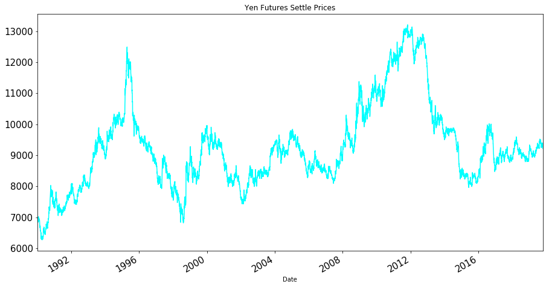
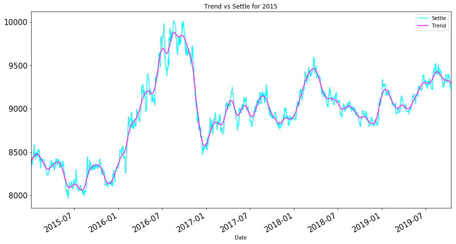
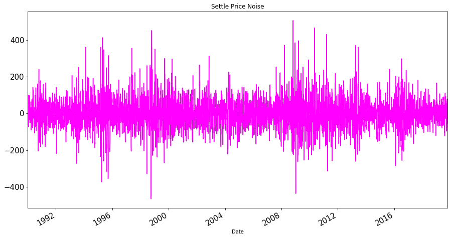
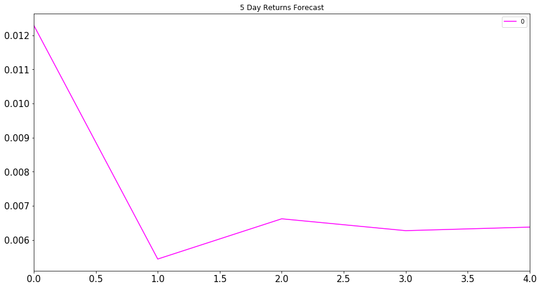
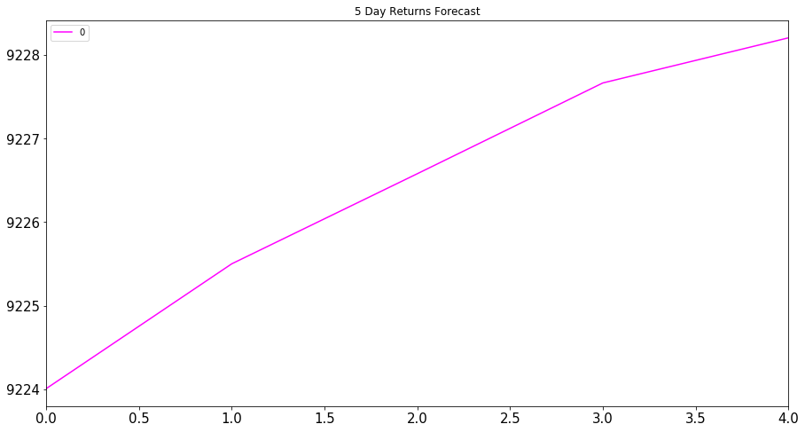
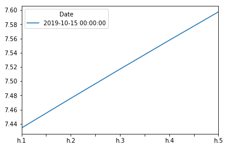

```python
import numpy as np
import pandas as pd
from pathlib import Path
%matplotlib inline
```

# Return Forecasting: Read Historical Daily Yen Futures Data
In this notebook, you will load historical Dollar-Yen exchange rate futures data and apply time series analysis and modeling to determine whether there is any predictable behavior.


```python
# Futures contract on the Yen-dollar exchange rate:
# This is the continuous chain of the futures contracts that are 1 month to expiration
yen_futures = pd.read_csv(
    Path("yen.csv"), index_col="Date", infer_datetime_format=True, parse_dates=True
)
yen_futures.head()
```


<div>
<style scoped>
    .dataframe tbody tr th:only-of-type {
        vertical-align: middle;
    }

    .dataframe tbody tr th {
        vertical-align: top;
    }

    .dataframe thead th {
        text-align: right;
    }
</style>
<table border="1" class="dataframe">
  <thead>
    <tr style="text-align: right;">
      <th></th>
      <th>Open</th>
      <th>High</th>
      <th>Low</th>
      <th>Last</th>
      <th>Change</th>
      <th>Settle</th>
      <th>Volume</th>
      <th>Previous Day Open Interest</th>
    </tr>
    <tr>
      <th>Date</th>
      <th></th>
      <th></th>
      <th></th>
      <th></th>
      <th></th>
      <th></th>
      <th></th>
      <th></th>
    </tr>
  </thead>
  <tbody>
    <tr>
      <th>1976-08-02</th>
      <td>3398.0</td>
      <td>3401.0</td>
      <td>3398.0</td>
      <td>3401.0</td>
      <td>NaN</td>
      <td>3401.0</td>
      <td>2.0</td>
      <td>1.0</td>
    </tr>
    <tr>
      <th>1976-08-03</th>
      <td>3401.0</td>
      <td>3401.0</td>
      <td>3401.0</td>
      <td>3401.0</td>
      <td>NaN</td>
      <td>3401.0</td>
      <td>0.0</td>
      <td>1.0</td>
    </tr>
    <tr>
      <th>1976-08-04</th>
      <td>3401.0</td>
      <td>3401.0</td>
      <td>3401.0</td>
      <td>3401.0</td>
      <td>NaN</td>
      <td>3401.0</td>
      <td>0.0</td>
      <td>1.0</td>
    </tr>
    <tr>
      <th>1976-08-05</th>
      <td>3401.0</td>
      <td>3401.0</td>
      <td>3401.0</td>
      <td>3401.0</td>
      <td>NaN</td>
      <td>3401.0</td>
      <td>0.0</td>
      <td>1.0</td>
    </tr>
    <tr>
      <th>1976-08-06</th>
      <td>3401.0</td>
      <td>3401.0</td>
      <td>3401.0</td>
      <td>3401.0</td>
      <td>NaN</td>
      <td>3401.0</td>
      <td>0.0</td>
      <td>1.0</td>
    </tr>
  </tbody>
</table>
</div>


```python
# Trim the dataset to begin on January 1st, 1990
yen_futures = yen_futures.loc["1990-01-01":, :]
yen_futures.head()
```


<div>
<style scoped>
    .dataframe tbody tr th:only-of-type {
        vertical-align: middle;
    }

    .dataframe tbody tr th {
        vertical-align: top;
    }

    .dataframe thead th {
        text-align: right;
    }
</style>
<table border="1" class="dataframe">
  <thead>
    <tr style="text-align: right;">
      <th></th>
      <th>Open</th>
      <th>High</th>
      <th>Low</th>
      <th>Last</th>
      <th>Change</th>
      <th>Settle</th>
      <th>Volume</th>
      <th>Previous Day Open Interest</th>
    </tr>
    <tr>
      <th>Date</th>
      <th></th>
      <th></th>
      <th></th>
      <th></th>
      <th></th>
      <th></th>
      <th></th>
      <th></th>
    </tr>
  </thead>
  <tbody>
    <tr>
      <th>1990-01-02</th>
      <td>6954.0</td>
      <td>6954.0</td>
      <td>6835.0</td>
      <td>6847.0</td>
      <td>NaN</td>
      <td>6847.0</td>
      <td>48336.0</td>
      <td>51473.0</td>
    </tr>
    <tr>
      <th>1990-01-03</th>
      <td>6877.0</td>
      <td>6910.0</td>
      <td>6865.0</td>
      <td>6887.0</td>
      <td>NaN</td>
      <td>6887.0</td>
      <td>38206.0</td>
      <td>53860.0</td>
    </tr>
    <tr>
      <th>1990-01-04</th>
      <td>6937.0</td>
      <td>7030.0</td>
      <td>6924.0</td>
      <td>7008.0</td>
      <td>NaN</td>
      <td>7008.0</td>
      <td>49649.0</td>
      <td>55699.0</td>
    </tr>
    <tr>
      <th>1990-01-05</th>
      <td>6952.0</td>
      <td>6985.0</td>
      <td>6942.0</td>
      <td>6950.0</td>
      <td>NaN</td>
      <td>6950.0</td>
      <td>29944.0</td>
      <td>53111.0</td>
    </tr>
    <tr>
      <th>1990-01-08</th>
      <td>6936.0</td>
      <td>6972.0</td>
      <td>6936.0</td>
      <td>6959.0</td>
      <td>NaN</td>
      <td>6959.0</td>
      <td>19763.0</td>
      <td>52072.0</td>
    </tr>
  </tbody>
</table>
</div>


 # Return Forecasting: Initial Time-Series Plotting

 Start by plotting the "Settle" price. Do you see any patterns, long-term and/or short?


```python
# Plot just the "Settle" column from the dataframe:
yen_futures.Settle.plot(figsize=(15,8), fontsize = 15, colormap='cool', title="Yen Futures Settle Prices")
```


    <matplotlib.axes._subplots.AxesSubplot at 0x7fb94a197610>





---

# Decomposition Using a Hodrick-Prescott Filter

 Using a Hodrick-Prescott Filter, decompose the Settle price into a trend and noise.


```python
import statsmodels.api as sm
# Apply the Hodrick-Prescott Filter by decomposing the "Settle" price into two separate series:

yen_futures_noise, yen_futures_trend = sm.tsa.filters.hpfilter(yen_futures["Settle"])
```


```python
# Create a dataframe of just the settle price, and add columns for "noise" and "trend" series from above:
data = {'Settle': yen_futures.Settle, 'Noise': yen_futures_noise, 'Trend': yen_futures_trend}
df = pd.DataFrame(data)
df.index
```


    DatetimeIndex(['1990-01-02', '1990-01-03', '1990-01-04', '1990-01-05',
                   '1990-01-08', '1990-01-09', '1990-01-10', '1990-01-11',
                   '1990-01-12', '1990-01-15',
                   ...
                   '2019-10-02', '2019-10-03', '2019-10-04', '2019-10-07',
                   '2019-10-08', '2019-10-09', '2019-10-10', '2019-10-11',
                   '2019-10-14', '2019-10-15'],
                  dtype='datetime64[ns]', name='Date', length=7515, freq=None)


```python
# Plot the Settle Price vs. the Trend for 2015 to the present
df[['Settle', 'Trend']].loc['2015':].plot(fontsize = 15, colormap='cool', figsize=(15,8), title="Trend vs Settle for 2015")
```


    <matplotlib.axes._subplots.AxesSubplot at 0x7fb99213aa90>





```python
# Plot the Settle Noise
yen_futures_noise.plot(figsize=(15,8), colormap='cool_r', title="Settle Price Noise", fontsize= 15)
```


    <matplotlib.axes._subplots.AxesSubplot at 0x7fb9482046d0>





---

# Forecasting Returns using an ARMA Model

Using futures Settle *Returns*, estimate an ARMA model

1. ARMA: Create an ARMA model and fit it to the returns data. Note: Set the AR and MA ("p" and "q") parameters to p=2 and q=1: order=(2, 1).
2. Output the ARMA summary table and take note of the p-values of the lags. Based on the p-values, is the model a good fit (p < 0.05)?
3. Plot the 5-day forecast of the forecasted returns (the results forecast from ARMA model)


```python
# Create a series using "Settle" price percentage returns, drop any nan"s, and check the results:
# (Make sure to multiply the pct_change() results by 100)
# In this case, you may have to replace inf, -inf values with np.nan"s
returns = (yen_futures[["Settle"]].pct_change() * 100)
returns = returns.replace(-np.inf, np.nan).dropna()
returns.head()
```


<div>
<style scoped>
    .dataframe tbody tr th:only-of-type {
        vertical-align: middle;
    }

    .dataframe tbody tr th {
        vertical-align: top;
    }

    .dataframe thead th {
        text-align: right;
    }
</style>
<table border="1" class="dataframe">
  <thead>
    <tr style="text-align: right;">
      <th></th>
      <th>Settle</th>
    </tr>
    <tr>
      <th>Date</th>
      <th></th>
    </tr>
  </thead>
  <tbody>
    <tr>
      <th>1990-01-03</th>
      <td>0.584197</td>
    </tr>
    <tr>
      <th>1990-01-04</th>
      <td>1.756933</td>
    </tr>
    <tr>
      <th>1990-01-05</th>
      <td>-0.827626</td>
    </tr>
    <tr>
      <th>1990-01-08</th>
      <td>0.129496</td>
    </tr>
    <tr>
      <th>1990-01-09</th>
      <td>-0.632275</td>
    </tr>
  </tbody>
</table>
</div>


```python
from statsmodels.graphics.tsaplots import plot_acf, plot_pacf
```


```python
import statsmodels.api as sm
from statsmodels.tsa.arima_model import ARMA

# Estimate and ARMA model using statsmodels (use order=(2, 1))
model = ARMA(returns.values,  order=(2,1))

# Fit the model and assign it to a variable called results
results = model.fit()
```


```python
# Output model summary results:
results = model.fit()
results.summary()
```


<table class="simpletable">
<caption>ARMA Model Results</caption>
<tr>
  <th>Dep. Variable:</th>         <td>y</td>        <th>  No. Observations:  </th>   <td>7514</td>   
</tr>
<tr>
  <th>Model:</th>            <td>ARMA(2, 1)</td>    <th>  Log Likelihood     </th> <td>-7894.071</td>
</tr>
<tr>
  <th>Method:</th>             <td>css-mle</td>     <th>  S.D. of innovations</th>   <td>0.692</td>  
</tr>
<tr>
  <th>Date:</th>          <td>Sun, 23 Aug 2020</td> <th>  AIC                </th> <td>15798.142</td>
</tr>
<tr>
  <th>Time:</th>              <td>19:03:52</td>     <th>  BIC                </th> <td>15832.765</td>
</tr>
<tr>
  <th>Sample:</th>                <td>0</td>        <th>  HQIC               </th> <td>15810.030</td>
</tr>
<tr>
  <th></th>                       <td> </td>        <th>                     </th>     <td> </td>    
</tr>
</table>
<table class="simpletable">
<tr>
     <td></td>        <th>coef</th>     <th>std err</th>      <th>z</th>      <th>P>|z|</th>  <th>[0.025</th>    <th>0.975]</th>  
</tr>
<tr>
  <th>const</th>   <td>    0.0063</td> <td>    0.008</td> <td>    0.804</td> <td> 0.422</td> <td>   -0.009</td> <td>    0.022</td>
</tr>
<tr>
  <th>ar.L1.y</th> <td>   -0.3059</td> <td>    1.278</td> <td>   -0.239</td> <td> 0.811</td> <td>   -2.810</td> <td>    2.198</td>
</tr>
<tr>
  <th>ar.L2.y</th> <td>   -0.0019</td> <td>    0.019</td> <td>   -0.099</td> <td> 0.921</td> <td>   -0.040</td> <td>    0.036</td>
</tr>
<tr>
  <th>ma.L1.y</th> <td>    0.2944</td> <td>    1.278</td> <td>    0.230</td> <td> 0.818</td> <td>   -2.210</td> <td>    2.798</td>
</tr>
</table>
<table class="simpletable">
<caption>Roots</caption>
<tr>
    <td></td>   <th>            Real</th>  <th>         Imaginary</th> <th>         Modulus</th>  <th>        Frequency</th>
</tr>
<tr>
  <th>AR.1</th> <td>          -3.3382</td> <td>          +0.0000j</td> <td>           3.3382</td> <td>           0.5000</td>
</tr>
<tr>
  <th>AR.2</th> <td>        -157.3438</td> <td>          +0.0000j</td> <td>         157.3438</td> <td>           0.5000</td>
</tr>
<tr>
  <th>MA.1</th> <td>          -3.3973</td> <td>          +0.0000j</td> <td>           3.3973</td> <td>           0.5000</td>
</tr>
</table>


```python
# Plot the 5 Day Returns Forecast
pd.DataFrame(results.forecast(steps=5)[0]).plot(figsize=(15,8), colormap='cool_r', fontsize= 15, title= "5 Day Returns Forecast")
```


    <matplotlib.axes._subplots.AxesSubplot at 0x7fb948204190>





```python
results.forecast(steps=5)
```


    (array([0.01229407, 0.00543711, 0.0066175 , 0.00626945, 0.00637368]),
     array([0.69187027, 0.69191656, 0.69191748, 0.69191756, 0.69191757]),
     array([[-1.34374675,  1.36833489],
            [-1.35069442,  1.36156865],
            [-1.34951585,  1.36275085],
            [-1.34986405,  1.36240295],
            [-1.34975984,  1.3625072 ]]))


---

# Forecasting the Settle Price using an ARIMA Model

 1. Using the *raw* Yen **Settle Price**, estimate an ARIMA model.
     1. Set P=5, D=1, and Q=1 in the model (e.g., ARIMA(df, order=(5,1,1))
     2. P= # of Auto-Regressive Lags, D= # of Differences (this is usually =1), Q= # of Moving Average Lags
 2. Output the ARIMA summary table and take note of the p-values of the lags. Based on the p-values, is the model a good fit (p < 0.05)?
 3. Construct a 5 day forecast for the Settle Price. What does the model forecast will happen to the Japanese Yen in the near term?


```python
from statsmodels.tsa.arima_model import ARIMA

# Estimate and ARIMA Model:
# Hint: ARIMA(df, order=(p, d, q))

model = ARIMA(yen_futures.Settle.values,  order=(5,1,1))
# Fit the model
result = model.fit()
```


```python
# Output model summary results:
result.summary()
```


<table class="simpletable">
<caption>ARIMA Model Results</caption>
<tr>
  <th>Dep. Variable:</th>        <td>D.y</td>       <th>  No. Observations:  </th>    <td>7514</td>   
</tr>
<tr>
  <th>Model:</th>          <td>ARIMA(5, 1, 1)</td>  <th>  Log Likelihood     </th> <td>-41944.619</td>
</tr>
<tr>
  <th>Method:</th>             <td>css-mle</td>     <th>  S.D. of innovations</th>   <td>64.281</td>  
</tr>
<tr>
  <th>Date:</th>          <td>Sun, 23 Aug 2020</td> <th>  AIC                </th>  <td>83905.238</td>
</tr>
<tr>
  <th>Time:</th>              <td>19:03:54</td>     <th>  BIC                </th>  <td>83960.635</td>
</tr>
<tr>
  <th>Sample:</th>                <td>1</td>        <th>  HQIC               </th>  <td>83924.259</td>
</tr>
<tr>
  <th></th>                       <td> </td>        <th>                     </th>      <td> </td>    
</tr>
</table>
<table class="simpletable">
<tr>
      <td></td>         <th>coef</th>     <th>std err</th>      <th>z</th>      <th>P>|z|</th>  <th>[0.025</th>    <th>0.975]</th>  
</tr>
<tr>
  <th>const</th>     <td>    0.3158</td> <td>    0.700</td> <td>    0.451</td> <td> 0.652</td> <td>   -1.056</td> <td>    1.688</td>
</tr>
<tr>
  <th>ar.L1.D.y</th> <td>    0.2814</td> <td>    0.699</td> <td>    0.402</td> <td> 0.688</td> <td>   -1.090</td> <td>    1.652</td>
</tr>
<tr>
  <th>ar.L2.D.y</th> <td>    0.0007</td> <td>    0.016</td> <td>    0.042</td> <td> 0.966</td> <td>   -0.030</td> <td>    0.032</td>
</tr>
<tr>
  <th>ar.L3.D.y</th> <td>   -0.0127</td> <td>    0.012</td> <td>   -1.032</td> <td> 0.302</td> <td>   -0.037</td> <td>    0.011</td>
</tr>
<tr>
  <th>ar.L4.D.y</th> <td>   -0.0137</td> <td>    0.015</td> <td>   -0.890</td> <td> 0.374</td> <td>   -0.044</td> <td>    0.016</td>
</tr>
<tr>
  <th>ar.L5.D.y</th> <td>   -0.0012</td> <td>    0.018</td> <td>   -0.066</td> <td> 0.948</td> <td>   -0.036</td> <td>    0.034</td>
</tr>
<tr>
  <th>ma.L1.D.y</th> <td>   -0.2964</td> <td>    0.699</td> <td>   -0.424</td> <td> 0.672</td> <td>   -1.667</td> <td>    1.074</td>
</tr>
</table>
<table class="simpletable">
<caption>Roots</caption>
<tr>
    <td></td>   <th>            Real</th>  <th>         Imaginary</th> <th>         Modulus</th>  <th>        Frequency</th>
</tr>
<tr>
  <th>AR.1</th> <td>           1.8905</td> <td>          -1.3790j</td> <td>           2.3400</td> <td>          -0.1003</td>
</tr>
<tr>
  <th>AR.2</th> <td>           1.8905</td> <td>          +1.3790j</td> <td>           2.3400</td> <td>           0.1003</td>
</tr>
<tr>
  <th>AR.3</th> <td>          -2.2637</td> <td>          -3.0253j</td> <td>           3.7785</td> <td>          -0.3522</td>
</tr>
<tr>
  <th>AR.4</th> <td>          -2.2637</td> <td>          +3.0253j</td> <td>           3.7785</td> <td>           0.3522</td>
</tr>
<tr>
  <th>AR.5</th> <td>         -10.8643</td> <td>          -0.0000j</td> <td>          10.8643</td> <td>          -0.5000</td>
</tr>
<tr>
  <th>MA.1</th> <td>           3.3740</td> <td>          +0.0000j</td> <td>           3.3740</td> <td>           0.0000</td>
</tr>
</table>


```python
# Plot the 5 Day Price Forecast
pd.DataFrame(result.forecast(steps=5)[0]).plot(figsize=(15,8), colormap='cool_r', fontsize= 15, title= "5 Day Returns Forecast")
```


    <matplotlib.axes._subplots.AxesSubplot at 0x7fb927da7650>





```python
result.forecast(steps=5)
```


    (array([9224.00824179, 9225.50147784, 9226.57944549, 9227.66558386,
            9228.20532462]),
     array([ 64.28055074,  90.22570432, 110.09282009, 126.45210579,
            140.43685431]),
     array([[9098.02067743, 9349.99580615],
            [9048.66234689, 9402.34060878],
            [9010.80148316, 9442.35740782],
            [8979.82401074, 9475.50715699],
            [8952.95414807, 9503.45650118]]))


---

# Volatility Forecasting with GARCH

Rather than predicting returns, let's forecast near-term **volatility** of Japanese Yen futures returns. Being able to accurately predict volatility will be extremely useful if we want to trade in derivatives or quantify our maximum loss.
 
Using futures Settle *Returns*, estimate an GARCH model

1. GARCH: Create an GARCH model and fit it to the returns data. Note: Set the parameters to p=2 and q=1: order=(2, 1).
2. Output the GARCH summary table and take note of the p-values of the lags. Based on the p-values, is the model a good fit (p < 0.05)?
3. Plot the 5-day forecast of the volatility.


```python
from arch import arch_model
```


```python
# Estimate a GARCH model:

model = arch_model(returns, mean="Zero", vol="GARCH", p=2, q=1)

# Fit the model
results = model.fit(disp="off")
```


```python
# Summarize the model results
results.summary()
```


<table class="simpletable">
<caption>Zero Mean - GARCH Model Results</caption>
<tr>
  <th>Dep. Variable:</th>       <td>Settle</td>       <th>  R-squared:         </th>  <td>   0.000</td> 
</tr>
<tr>
  <th>Mean Model:</th>         <td>Zero Mean</td>     <th>  Adj. R-squared:    </th>  <td>   0.000</td> 
</tr>
<tr>
  <th>Vol Model:</th>            <td>GARCH</td>       <th>  Log-Likelihood:    </th> <td>  -7461.93</td>
</tr>
<tr>
  <th>Distribution:</th>        <td>Normal</td>       <th>  AIC:               </th> <td>   14931.9</td>
</tr>
<tr>
  <th>Method:</th>        <td>Maximum Likelihood</td> <th>  BIC:               </th> <td>   14959.6</td>
</tr>
<tr>
  <th></th>                        <td></td>          <th>  No. Observations:  </th>    <td>7514</td>   
</tr>
<tr>
  <th>Date:</th>           <td>Sun, Aug 23 2020</td>  <th>  Df Residuals:      </th>    <td>7510</td>   
</tr>
<tr>
  <th>Time:</th>               <td>19:03:55</td>      <th>  Df Model:          </th>      <td>4</td>    
</tr>
</table>
<table class="simpletable">
<caption>Volatility Model</caption>
<tr>
      <td></td>        <th>coef</th>     <th>std err</th>      <th>t</th>       <th>P>|t|</th>      <th>95.0% Conf. Int.</th>   
</tr>
<tr>
  <th>omega</th>    <td>4.2896e-03</td> <td>2.057e-03</td> <td>    2.085</td> <td>3.708e-02</td>  <td>[2.571e-04,8.322e-03]</td>
</tr>
<tr>
  <th>alpha[1]</th> <td>    0.0381</td> <td>1.282e-02</td> <td>    2.970</td> <td>2.974e-03</td>  <td>[1.295e-02,6.321e-02]</td>
</tr>
<tr>
  <th>alpha[2]</th>   <td>0.0000</td>   <td>1.703e-02</td>   <td>0.000</td>   <td>    1.000</td> <td>[-3.338e-02,3.338e-02]</td>
</tr>
<tr>
  <th>beta[1]</th>  <td>    0.9536</td> <td>1.420e-02</td> <td>   67.135</td>   <td>0.000</td>      <td>[  0.926,  0.981]</td>  
</tr>
</table><br/><br/>Covariance estimator: robust


```python
# Find the last day of the dataset
last_day = returns.index.max().strftime('%Y-%m-%d')
last_day
```


    '2019-10-15'


```python
# Create a 5 day forecast of volatility
forecast_horizon = 5
# Start the forecast using the last_day calculated above
forecasts = results.forecast(start=last_day, horizon=forecast_horizon)
forecasts
```


    <arch.univariate.base.ARCHModelForecast at 0x7fb92a2d5050>


```python
# Annualize the forecast
intermediate = np.sqrt(forecasts.variance.dropna() * 252)
intermediate.head()
```


<div>
<style scoped>
    .dataframe tbody tr th:only-of-type {
        vertical-align: middle;
    }

    .dataframe tbody tr th {
        vertical-align: top;
    }

    .dataframe thead th {
        text-align: right;
    }
</style>
<table border="1" class="dataframe">
  <thead>
    <tr style="text-align: right;">
      <th></th>
      <th>h.1</th>
      <th>h.2</th>
      <th>h.3</th>
      <th>h.4</th>
      <th>h.5</th>
    </tr>
    <tr>
      <th>Date</th>
      <th></th>
      <th></th>
      <th></th>
      <th></th>
      <th></th>
    </tr>
  </thead>
  <tbody>
    <tr>
      <th>2019-10-15</th>
      <td>7.434048</td>
      <td>7.475745</td>
      <td>7.516867</td>
      <td>7.557426</td>
      <td>7.597434</td>
    </tr>
  </tbody>
</table>
</div>


```python
# Transpose the forecast so that it is easier to plot
final = intermediate.dropna().T
final.head()
```


<div>
<style scoped>
    .dataframe tbody tr th:only-of-type {
        vertical-align: middle;
    }

    .dataframe tbody tr th {
        vertical-align: top;
    }

    .dataframe thead th {
        text-align: right;
    }
</style>
<table border="1" class="dataframe">
  <thead>
    <tr style="text-align: right;">
      <th>Date</th>
      <th>2019-10-15 00:00:00</th>
    </tr>
  </thead>
  <tbody>
    <tr>
      <th>h.1</th>
      <td>7.434048</td>
    </tr>
    <tr>
      <th>h.2</th>
      <td>7.475745</td>
    </tr>
    <tr>
      <th>h.3</th>
      <td>7.516867</td>
    </tr>
    <tr>
      <th>h.4</th>
      <td>7.557426</td>
    </tr>
    <tr>
      <th>h.5</th>
      <td>7.597434</td>
    </tr>
  </tbody>
</table>
</div>


```python
# Plot the final forecast
final.plot()
```


    <matplotlib.axes._subplots.AxesSubplot at 0x7fb92a428d50>





---

# Conclusions

Based on your time series analysis, would you buy the yen now?

Is the risk of the yen expected to increase or decrease?

Based on the model evaluation, would you feel confident in using these models for trading?

### Based on your time series analysis, would you buy the yen now?: Overall trend Yen/ USD is upward. Prices are increasing so i would buy Yen. 
### Is the risk of the yen expected to increase or decrease? - the volatility is increasing so yes the risk is increasing. 
### Based on the model evaluation, would you feel confident in using these models for trading? - ARMA model is not significant based on the (p > 0.05), so it doesn't allow us to do a good judgement call. ARIMA model (p > 0.05) - I would not use it for the estimations as well.  GARCH model (p < 0.05) gives us more confidence to predict volatility but it does not allow to make a buy/sell call. I won't be confident in using these models at least in ARMA / ARIMA (p=2 and q=1 / p=5, d=1, q=1). 


```python

```
